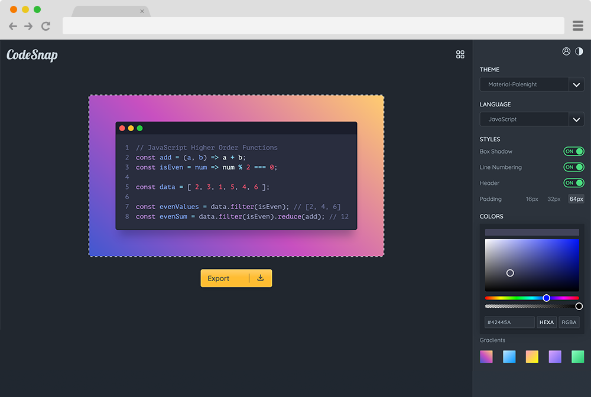

<p align="center">
  
</p>

## Introduction
CodeSnap is a web application that allows users to add snippets of code inside a text field right in on the webpage. Users can then apply styling and snap a screenshot for socials.

Users will be able to change the main background color of the site to whatever they want. A future update will allow users to select different themes of code text.

<br>

<p align="left">
  
</p>

<br>

### 🧐 What's inside?
A quick look at the files and directories you'll see in the repo.

```bash
├─ src
│ ├─ assets
│ │ └─ repo image files
│ ├─ js
│ │ ├─ components
│ │ ├─ app.js
│ │ ├─ codemirror.js
│ │ ├─ color-picker.js
│ │ ├─ darkmode.js
│ │ └─ toggles.js
│ ├─ index.html
│ ├─ style.css
│ └─ README.md
```

----

### 📌 App Features
1. Screenshot code snippets
2. Customize background color
3. Toggle editor styles (header, box-shadow, margins, etc)
4. Share snippets to social media platforms
5. Dark and light theme support

----

### 🚘 Road Map
- [x] Implement CodeMirror.
- [x] Toggle editor styles.
    - [x] Box shadow toggle.
    - [x] Line numbering toggle.
    - [x] Header toggle.
    - [ ] Language tag toggle.
- [x] Customize background color.
- [ ] Export to jpg and png button.
- [ ] Custom CodeSnap editor themes.
- [ ] Copy code button in text editor.
- [ ] Share to social platforms button (Twitter, Instagram, etc).
- [ ] Profile page.
- [ ] Customize font families.
- [ ] More functionality (tab sizing, font styles, font sizing, etc).

----

### ⚒️ Built With
* HTML
* CSS
* JavaScript

----

### 💭 Thoughts
1. Social aspect to the app:
    * Allow users to save other users' code snippets.
    * Users can comment on other users' code snippet and make edits/suggestions.
        * Edits and suggestions can be done right in the editor. Once "submitted" original snippet is unchanged but a snapshot of the suggested editor is posted in the comments along with a description (Slack style).
    * On editor hover, pin icon (outline) displays
        * Pin to your collection
        * If pinned, icon displays filled
    * Profile page
        * "Your Collections" tab
    * Share code snippets between users and social media accounts.

----

### 🍄 Inspiration
[draftbit.com](https://draftbit.com/)

----

### 🔗 Project Resources
CodeMirror:
* [CodeMirror User Manual](https://codemirror.net/doc/manual.html)
* [CodeMirror Setup Guide](https://www.youtube.com/watch?v=o1DDWQDBT9Y)
* [Changing Mode](https://codemirror.net/doc/manual.html#setOption)
* [Changing Mode StackOverflow](https://stackoverflow.com/questions/6130563/how-to-dynamically-switch-modes-with-codemirror)

Color Picker:
* [Customize ColorPicker in JavaScript](https://ej2.syncfusion.com/javascript/documentation/color-picker/how-to/customize-colorpicker/)
* [Input type color](https://developer.mozilla.org/en-US/docs/Web/HTML/Element/input/color)
* [Color Picker Tutorial 1](https://www.youtube.com/watch?v=RSbZJYVQmPU)
* [Color Picker Tutorial 2](https://www.youtube.com/watch?v=DP9-CVgkgDA)
* [Input Type Color Tutorial](https://www.youtube.com/watch?v=eIw-Nou9L9E)

Misc:
* [Color is Math](https://dev.to/madsstoumann/colors-are-math-how-they-match-and-how-to-build-a-color-picker-4ei8)
* [Auto-grow text area](https://css-tricks.com/the-cleanest-trick-for-autogrowing-textareas/)
* [Copy Text to Clipboard](https://www.30secondsofcode.org/blog/s/copy-text-to-clipboard-with-javascript)

highlight.js: 
* [highlight.js Usage](https://highlightjs.org/usage/)
* [highlight.js Docs](https://highlightjs.readthedocs.io/en/latest/)

Creating a Syntax Highlighter:
* [MDN Syntax Highlighter](https://developer.mozilla.org/en-US/docs/MDN/Editor/Syntax_highlighting)
* [W3 Syntax Highlighter](https://www.w3schools.com/howto/howto_syntax_highlight.asp)

----

### Contributing
Contributions are always welcome! All I ask is that you open an issue and we discuss your proposed changes before you create a pull request.

----

### License
CodeSnap is [MIT licensed](#)